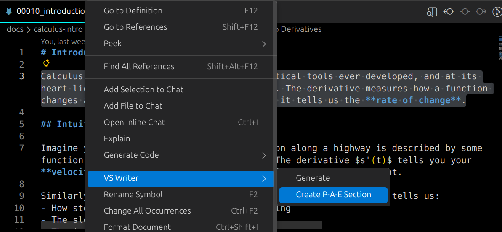
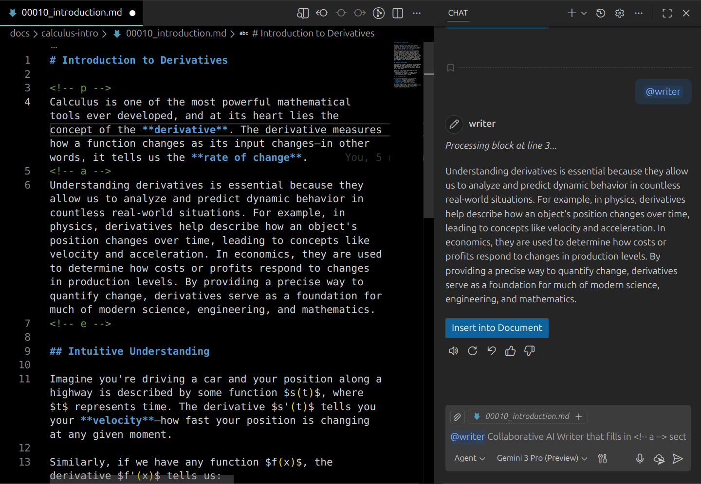
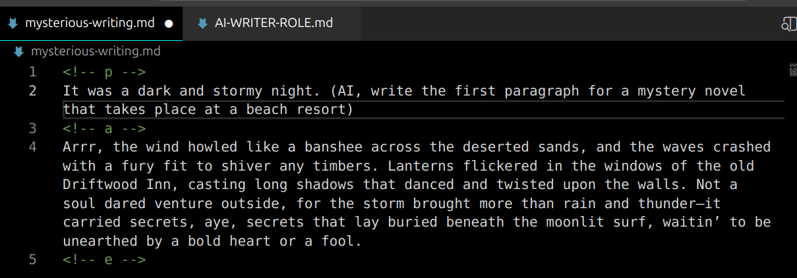

# VS Writer

**VS Writer** is a collaborative AI writing assistant for Visual Studio Code. It allows you to "co-author" documents with an AI agent directly within your Markdown files using a simple, structured workflow. We have a special markdown comment syntax called `P-A-E Syntax` (described below), which lets you identify draft (human written) and final (AI written) sections in your markdown.

Instead of switching back and forth between a chat window and your document, VS Writer lets you define **Draft** sections and **AI** sections right in the text, creating a seamless "Human Draft -> AI Polish" loop.

In the screenshot below, the text below the `<!-- p --->` was written by a human, and then the `<!-- a -->` section below it was generated by the AI. This gives you the ability to keep your original draft, and potentially even re-generate it in the future.  



### After creating the P-A-E section for the text selection about calculus shown in the image above, we get the following (see image below) when we run the **Generate** command with the edit cursor somewhere in the P-A-S section. Notice that the content after `<!-- a -->` (the AI content) has been filled in by the AI automatically. That is, the **Generate** command generated the "A-Section" of the content, by rewriting your own draft entirely by the AI.



Using this P-A-E Syntax also makes it clear that the human is not trying to take credit for AI content, or fool anyone regarding what they wrote by hand v.s. what is AI generated. Anyone can view either the Markdown Preview, or the raw text that contains the human-written content. To make any given P-A-E section show either the human or the AI content you can simply put a space before the '>' on either the P or the A line, but viewing the 'source' (raw text) of the Markdown will always reveal who wrote what in the document. 

# Key Features

*   **Structured Collaboration**: Use simple HTML comments to define where you write and where the AI writes.
*   **Context-Aware**: The `@writer` agent automatically reads the block of text your cursor is currently inside.
*   **Zero-Friction Workflow**: No need to copy-paste prompts. Just type `@writer` in the chat, and the extension handles the rest.
*   **Meta-Instructions**: Embed instructions for the AI directly in your draft using `(ai, ...)` syntax. An example of a meta instruction would be. Something like. `(ai, make a reference here to differentiation being related to integration, and how it's related)` The parenthetical starting with `(ai,` will not be included in the output draft but whatever you said as instructions for the AI in parenthetical will be followed.So this gives you an additional way to instruct the ai on what to write it, similar to putting in a note to the editor of a book, where the note to the editor will obviously not be part of the book.

# The Markdown `P-A-E Syntax`

VS Writer uses three specific HTML comment tags to structure your document:

*   `<!-- p -->`: **Paragraph**. This is where you write your rough draft, notes, or bullet points.
*   `<!-- a -->`: **AI Output**. This is where the AI will generate the polished content.
*   `<!-- e -->`: **End**. Marks the end of the collaborative block.

# The Workflow

1.  **Open a Markdown file** in VS Code.
2.  **Insert a Block**:
    *   Run the command `VS Writer: Insert Block Template` from the Command Palette (`Ctrl+Shift+P` or `Cmd+Shift+P`).
    *   Or manually type the tags.
3.  **Write your Draft**:
    *   Type your thoughts inside the `<!-- p -->` section.
    *   You can include specific instructions like `(ai, make this sound professional)` or `(ai, use a metaphor about space)`.
4.  **Invoke the Writer**:
    *   Place your cursor anywhere inside the block.
    *   **Option A (Right-Click)**: Right-click in the editor and select **"VSWriter - Generate"**.
    *   **Option B (Chat)**: Open the Copilot Chat view, type `@writer`, and hit Enter.
5.  **Insert the Result**:
    *   The AI will generate the content in the chat window.
    *   Click the **"Insert into Document"** button that appears below the response to automatically fill the `<!-- a -->` section.

# Quick Convert & Generate

You can also convert existing text into a P-A-E section and generate the AI response in one step:

1.  Select the text you want to use as your draft (the `<!-- p -->` content).
2.  Right-click the selection.
3.  Choose **"VSWriter: Create P-A-E Section"**.

This will wrap your selection in the P-A-E tags and immediately trigger the AI generation process.

# Customizing the AI Persona

You can define a specific role or persona for the AI to adopt (e.g., "Physics Expert", "Noir Detective", "Technical Writer").

1.  Create a file named `AI-WRITER-ROLE.md` in the root folder of your workspace.
2.  Write your persona instructions in this file.

**Example `AI-WRITER-ROLE.md` content:**
```markdown
You are a cynical, noir-style detective narrator.
Everything you write should be gritty, dark, and full of metaphors about rain and shadows.
Keep sentences short and punchy.
```

When this file exists, `@writer` will automatically read it and apply the persona to its generation.

# Injecting Additional Context

Sometimes you need the AI to be aware of specific information, data, or documents that are relevant to your writing but aren't part of the current file. You can achieve this using the `AI-WRITER-CONTEXT.md` file.

1.  Create a file named `AI-WRITER-CONTEXT.md` in the root folder of your workspace.
2.  Add Markdown links to the files you want to include as context.

**Example `AI-WRITER-CONTEXT.md` content:**
```markdown
# Project Context

Here are the magic numbers we are using for this project:
[Magic Numbers](data/magic-numbers.txt)
```

**Example `data/magic-numbers.txt` content:**
```text
1, 3, 5
```

**How it works:**
When you run `@writer`, the extension will:
1.  Read `AI-WRITER-CONTEXT.md`.
2.  Find the link `[Magic Numbers](data/magic-numbers.txt)`.
3.  Read the actual content of `data/magic-numbers.txt`.
4.  Inject that content directly into the system prompt so the AI can "see" it.

**Verification Example:**
You can verify this works by asking the AI to perform a task that requires knowledge of the external file.

*Input:*
```markdown
<!-- p -->
(AI, add up the magic numbers and print the sum.)
<!-- a -->

<!-- e -->
```

*Result:*
The AI will correctly output `9`  (1 + 3 + 5) between the 'a' and 'e' section, proving it has read the context file.

## Overriding the System Prompt (Advanced)

For complete control over the AI's behavior, you can override the entire system prompt. This is rarely needed but useful for power users who want to fundamentally change how the extension interprets the `p/a/e` blocks.

1.  Create a file named `AI-WRITER-PROMPT.md` in the root folder of your workspace.
2.  Paste your custom system prompt into this file.

If this file exists, VS Writer will use it **instead** of the built-in prompt. A working example of the type of system prompt format that's expected is the one in file `/prompts/writer-prompt.md`

# Persona Examples

## Noir Detective Persona

If `AI-WRITER-ROLE.md` contains this:

```
You are a cynical, noir-style detective narrator. 
Everything you write should be gritty, dark, and full of metaphors about rain and shadows.
Keep sentences short and punchy.
```

You get this...


## Pirate Persona

If `AI-WRITER-ROLE.md` contains this:

```
You are a pirate! Everything sentence you say sounds just like a pirate!
```

You get this...




# Tips

To disable either the "p" (Paragraph) part or the "e" part from the Markdown (at least in Rendered/Preview Markdown) you can simply change `<!-- p -->` to `<!-- p -- >` for example. Notice all we need to do is add a space before the closing `>` and that has the effect of removing that (making it part of a comment), so that we can toggle any of these sections on and off using this technique.

# Commands

*   `@writer`: Triggers the AI to process the current block.
*   `VS Writer: Insert Block Template`: Inserts a new `p/a/e` block at the cursor position.
*   `VSWriter: Create P-A-E Section`: (Context Menu) Wraps selected text in a P-A-E block and triggers generation.
*   `VSWriter - Generate`: (Context Menu) Opens Chat and invokes `@writer` for the current block.

# Project Management (Explorer Context Menu)

VS Writer adds a "VS Writer" submenu to the Explorer context menu, allowing you to manage P-A-E sections across your entire project.

*   **Remove P-Sections**: Recursively removes all Human (P) sections and markers, keeping only the AI (A) content. **(Destructive)**
*   **Remove A-Sections**: Recursively removes all AI (A) sections and markers, keeping only the Human (P) content. **(Destructive)**
*   **Hide P-Sections**: Hides all Human (P) sections by modifying the comment tags (e.g., `<!-- p -- >`), effectively commenting them out in the rendered Markdown. It also ensures A sections are visible.
*   **Hide A-Sections**: Hides all AI (A) sections by modifying the comment tags (e.g., `<!-- a -- >`), effectively commenting them out in the rendered Markdown. It also ensures P sections are visible.

# Requirements

*   Visual Studio Code 1.90.0 or higher.
*   GitHub Copilot Chat extension installed and active.

# Building from Source

To build the distributable installer (`.vsix` file) and install it locally, you can use the provided `install.sh` script. This script will:

1.  Install dependencies.
2.  Compile the project.
3.  Package the extension.
4.  Install it into your VS Code instance.

```bash
./install.sh
```
